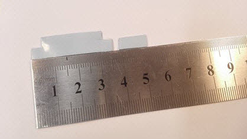
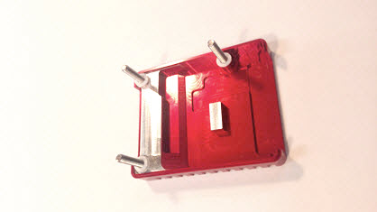
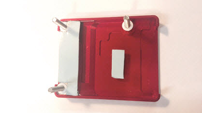
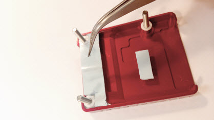
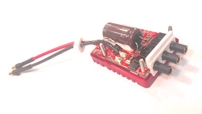
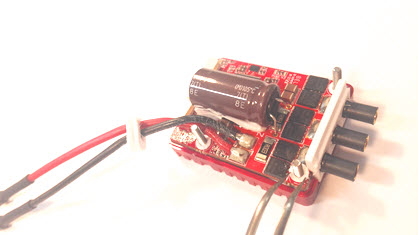
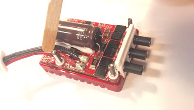
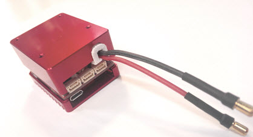
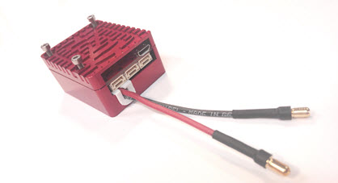
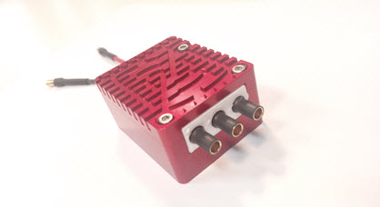

# Aluminum enclosure assembly manual

## Parts needed
| Parts                                                       | Amount            |
|-------------------------------------------------------------|-------------------|
| Myxa A/B	                                                  |   1 pcs           |
| Aluminum enclosure 	                                        |   1 set           |
| Plastic washers ⌀3 thickness 0.5 mm 	                      |   6 pcs           |
| 3D printed plastic sleeve set 	                            |   1 set           |
| Thermal pad 1 mm thick Arctic ACTPD0005A (two layers of 0.5 mm are acceptable but not recommended) | one strip 10x48 mm |
| Steel hex screw DIN 912 M2.5x16mm	                          |   3 pcs           |
| Zapon lacquer or similar                                   	| approx. 0.5 ml    |

## Tools needed
* Knife
* Tweezers
* Ruler
* Hex key 2 mm (either an L-shaped key or a screwdriver)
* 50 VDC lab power supply

## Assembly
First, prepare a 10 mm wide strip of the thermal pad. Use the ruler and the knife to ensure that the cutoff line is straight. Afterward, cut the stripe into two patches: one 10 x 35 mm and one 6 х 13 mm. 

Put the three screws into the holes on the top part of the enclosure and insert plastic washers on them.

Remove the protective film from one side of the patches and carefully place them onto the heat exchange surfaces of the heat sink, as shown on the image. Do not touch the heat exchange surfaces while assembling the enclosure. This is because the grease from human hands may impair thermal conductivity of the interface.
You must ensure that the longer patch is perfectly aligned with the edges of the enclosure. If necessary, use the tweezers to align the large patch at the edges.

When both patches are put in place and aligned properly, remove the protective film from the other side using the tweezers. 

   

Slide the 3D-printed plastic parts named `battery_wires_spacer` and `phase_insert` onto the power supply wires and the phase connectors of the Myxa ESC, respectively.

Mount the Myxa PCB on the top part of the enclosure and insert washers on the top side of the board.  

   

Apply varnish/lacquer on the threaded ends of the screws. This is needed to fix the screws in place to prevent unintended disassembly of the device when exposed to vibrations - the varnish/lacquer is acting as a glue here. 
The battery wire spacer and phase insert should be glued in place using the varnish/lacquer too; otherwise, there's a risk that they can move or fall off.

Carefully lower the bottom part of the enclosure onto the screws. Make sure that the screws are aligned with the holes on the bottom part of the enclosure. Make a few turns of each screw by hand. Afterward, close the two parts of the enclosure.

   

Tighten the screws.

